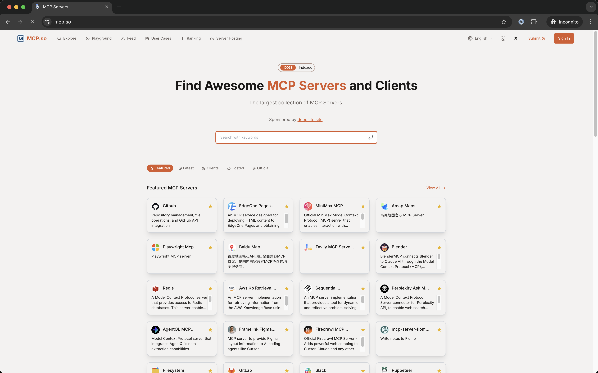
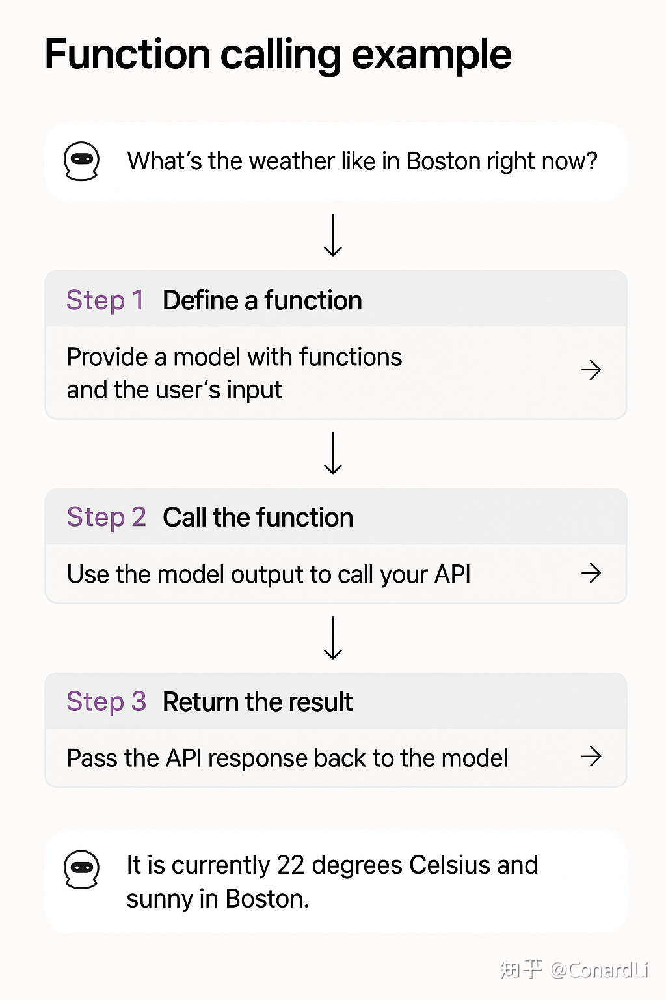
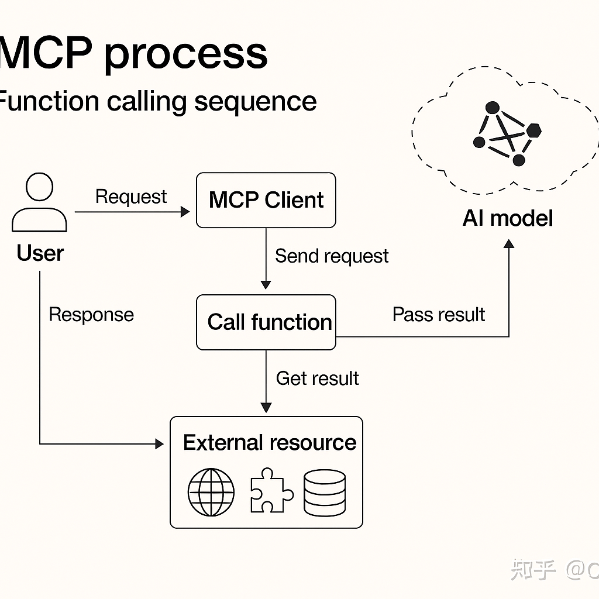
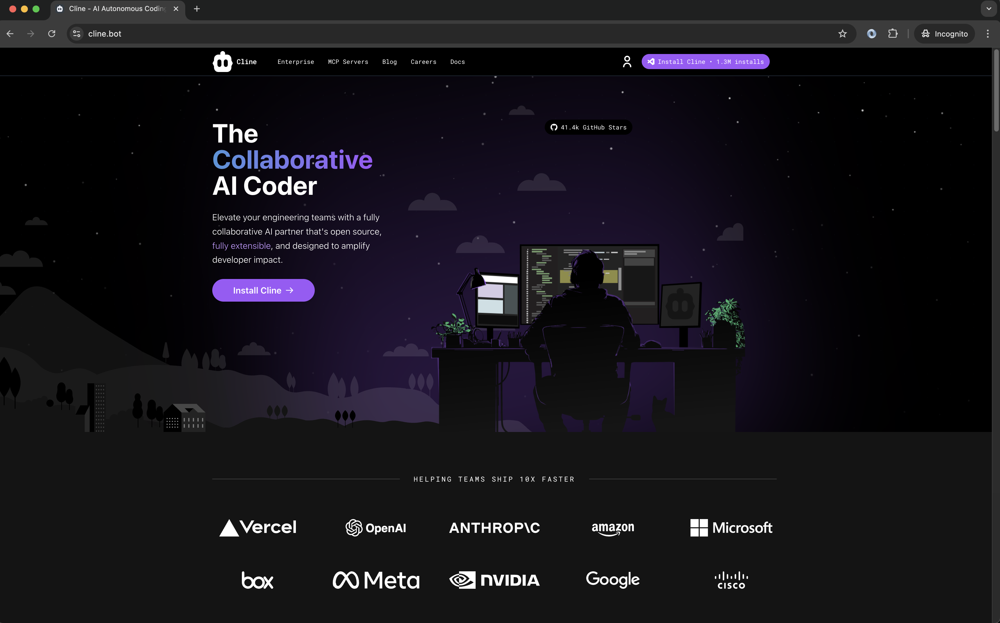
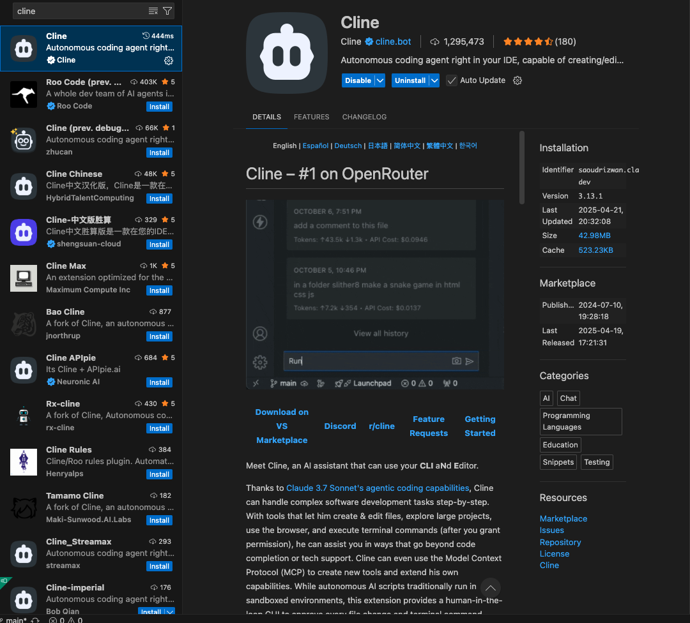

# 理解 MCP：让大模型真正动起来

在智能体（Agent）和大模型的结合越来越深入的今天，MCP（Model Callable Plugin）作为大模型能力拓展的一种方式，正变得越来越重要。本文结合我的实践经验，系统梳理 MCP、Function Call 的原理与关系，并分析它们如何一起协作、发挥威力。
---


## 1. 什么是 MCP（Model Callable Plugin）

MCP（Model Context Protocol，模型上下文协议）是由 Anthropic 公司（也就是开发 Claude 模型的公司）推出的一个开放标准协议，就像是一个 “通用插头” 或者 “USB 接口”，制定了统一的规范，不管是连接数据库、第三方 API，还是本地文件等各种外部资源，目的就是为了解决 AI 模型与外部数据源、工具交互的难题。它通常包含以下核心要素：

- **能力封装**：MCP 是一个具备特定业务逻辑的 API 服务（如查询天气、操作 GitHub、访问数据库）。
- **结构化接口**：MCP 必须提供标准化的 JSON Schema，用于描述如何被调用（参数、返回结构）。
- **可解释执行**：大模型通过 Function Call 理解接口结构并构造调用参数，从而发起请求。

MCP = Plugin + 标准接口 + 被大模型“理解和调用”的能力。
---


作为mcp的开发者和使用者，可以多在mcp的网站上看看别人提供了什么样的工具，怎么使用给自己找找灵感也减少重复造轮子的可能。


## 2. 什么是 Function Call？

在描述mcp的时候就不得不提到一个概念：*function call*

Function Call 是一种大模型（如 OpenAI GPT-4）支持的机制，允许开发者将函数定义（包括函数名、参数 schema 和描述）作为上下文传入，大模型将基于对用户意图的理解主动构造函数调用。

Function Call 支持的过程包括：

- 函数注册（提供 JSON schema）
- 用户发起自然语言请求
- 模型判断是否触发函数
- 自动填参并返回调用结构（如：`{"name": "get_weather", "arguments": { "city": "Beijing" }}`）



注： funcationcall 不是每个模型都支持，在使用的时候需要注意分辨
---

## 3. MCP 与 Function Call 的关系

| 对比点 | MCP | Function Call |
|--------|-----|----------------|
| 定义者 | 开发者（写接口） | LLM 平台（如 OpenAI） |
| 执行角色 | 后端服务/插件 | 大模型（判断并填参） |
| 触发方式 | 被调用 | 主动调用 |
| 内容描述 | 提供接口 schema | 接收并使用 schema |
| 核心价值 | 封装外部功能 | 把自然语言映射为结构化调用 |

✅ **MCP 是执行单元，Function Call 是触发机制**。  
在一个作者认为比较友好的系统里面，他们之间的关系应该是这样的，既有function call的优雅，又具备了MCP的灵活和可插拔：

> 用户请求 → 大模型判断 → 发起 Function Call → 调用 MCP → 返回结果 → 再由模型回复用户
---

## 4. MCP 原理解析：提示词 vs Function Call

### ☁️ 传统提示词实现

早期实现 MCP 的方式是通过提示词引导模型输出特定格式，然后在后端解析结构、执行功能。

示例 Prompt：

```text
你是一个天气助手，当用户问天气时，请输出如下格式：
{"city": "北京", "date": "明天"}
```
虽然这种方式可行，但仍存在一些不可忽视的问题：
> •	容易 hallucination（模型胡编）
> 
> •	格式控制弱
> 
> •	不适合大规模场景扩展
> 

提示词带来的问题除了不够优雅，可能会是一个提示词的编写灾难，庞大的提示词工程让后续的维护变的困难，同时消耗大量token。

### ⚙️ Function Call 实现


现在，通过 Function Call，模型可以可靠地产生结构化请求，并且可以自动决定 是否 调用、调用哪个函数，以及如何构造参数。

实现步骤：
> 	1.	定义函数 schema，注册给模型
> 	2.	接收用户自然语言请求
> 	3.	模型输出结构化调用结构
> 	4.	后端调用 MCP 服务（真实 API）
> 	5.	模型将返回值生成自然语言回答

```text
{
  "name": "get_weather",
  "description": "查询天气",
  "parameters": {
    "type": "object",
    "properties": {
      "city": { "type": "string", "description": "城市名称" },
      "date": { "type": "string", "description": "日期" }
    },
    "required": ["city"]
  }
}
```
个人推荐的方式（前提您选的模型是支持functioncall的），优雅的实现。


### 调用连
不管是什么方式的调用，总体的调用方式基本维持一致。

**在这个里面有一个非常重要的事情，多数情况下大模型作为一个总结和意图识别的重要的节点依旧保持，所以开发一个mcp真的万事大吉的思想需要摒弃，在决定是否通过MCP实现某功能时，扔需要权衡场景复杂性和收益**



## 5. MCP 应用场景与当前实践
MCP 正在多个领域落地使用：
| 场景 | 示例 | 
|--------|-----|
| 开发者助手 | Github MCP:查询PR,列出仓库 | 
| 知识增强 | 通过插件访问企业知识库 | 
| IoT & 系统控制 | 控制智能硬件、出发外部系统任务 | 
| 企业集成 | ERP、OA等系统封装为MCP| 
| 数据分析 | 通过MCP接口调用分析引擎（如SQL) | 

🔧 当前实践工具：
> 	•	OpenAI Plugin / Function Call
> 
> 	•	LangChain Tool / Agent / Runnable
> 
> 	•	Dify 插件系统
> 
> 	•	Clerk、Cursor 插件
> 
> 	•	自建插件平台 + LLM 接口封装

## 6. MCP的初体验
VS CODE + CLINE 是一个对很开发者或者有开发经验的人的一个上手体验的理想起点，通过在vs code 上安装cline的插件的方式来体验一个MCP是很有必要的（注：CLINE是token消耗大户）


在vs code的插件中找到对应的组件进行安装，此处不作过多的配置说明，可以很容易的在网上找到。



## 开发 MCP 要注意的坑
- ❌ 忽略 JSON Schema 的描述，导致模型填参失败
- ❌ 让 MCP 变成了后端“胶水”，没有设计出清晰功能边界
- ❌ 把模型当作同步 API 调用引擎，忽视模型的多轮交互能力
## 📚 延伸阅读
- Anthropic 官方 MCP 协议文档：[https://docs.anthropic.com/](https://docs.anthropic.com/)
- OpenAI Function Call 示例项目：[https://platform.openai.com/docs/guides/function-calling](https://platform.openai.com/docs/guides/function-calling)
- LangChain Tool 注册方法：[https://docs.langchain.com/docs/components/tools](https://docs.langchain.com/docs/components/tools)